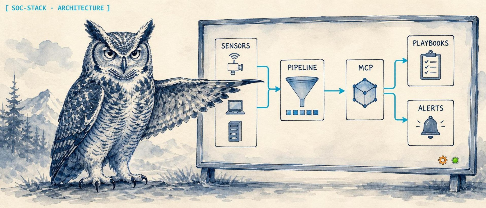

<p align="center">
  
</p>

<h1 align="center">SOC Stack</h1>

<p align="center">
  <strong>One-shot Proxmox installer for a complete Security Operations Center.</strong>
</p>

<p align="center">
  
  
  
  
  
  
  
  
  
</p>

Run one command on a Proxmox host, or have an agent do it, and ~30 minutes later you have Wazuh (SIEM), TheHive + Cortex (case management + SOAR), MISP (threat intel), Zeek + Suricata (NSM + IDS), custom dashboards, and 9 MCP servers wired up and talking to each other. Non-interactive by default. Idempotent. JSON output for agents. Built for replication.

## Quick start

**Full stack** (every component, sensible defaults):

```bash
curl -sSL https://raw.githubusercontent.com/solomonneas/soc-stack/main/install.sh | sudo bash
```

**Custom subset:**

```bash
curl -sSL https://raw.githubusercontent.com/solomonneas/soc-stack/main/install.sh | sudo bash -s -- \
  --components wazuh,thehive-cortex,misp \
  --preset standard \
  --bridge vmbr0 --storage local-lvm
```

**Agent-driven** (fully non-interactive, structured output):

```bash
curl -sSL https://raw.githubusercontent.com/solomonneas/soc-stack/main/install.sh | sudo bash -s -- \
  --components all \
  --preset minimal \
  --bridge vmbr0 --storage local-lvm --ip-mode dhcp \
  --json-out /root/soc-stack.json \
  --mcp-config-out /root/mcp-clients.json
```

After install:
- `/root/soc-stack.json` lists every component with its LXC VMID, IP, ports, endpoints, and rotated credentials.
- `/root/mcp-clients.json` is a paste-ready `mcpServers` config block for Claude Desktop, OpenClaw, or any MCP client.
- `/var/lib/soc-stack/state/` has per-component state files used for idempotent re-runs.
- `/var/lib/soc-stack/secrets/` has every generated credential (mode 0600, root-only) for audit recovery.

Re-run the same command with `--force` to redeploy a completed component, or with `--components <one>` to add a single component to an existing install.

## Components

| Component | Services | LXC preset (minimal) | Ports |
|---|---|---|---|
| **wazuh** | Wazuh Manager, Indexer, Dashboard | 2 vCPU, 2 GB RAM, 30 GB | 443, 1514, 1515, 55000 |
| **thehive-cortex** | TheHive 5.4, Cortex 3.1.8, Elasticsearch 7.17, Cassandra 4.1 | 2 vCPU, 4 GB RAM, 30 GB | 9000, 9001 |
| **misp** | MISP, MariaDB 10.11, Redis 7, misp-modules | 1 vCPU, 2 GB RAM, 20 GB | 443 |
| **zeek-suricata** | Zeek (NSM), Suricata (IDS/IPS) | 1 vCPU, 2 GB RAM, 20 GB | 47760 |
| **dashboards** | Bro Hunter + Playbook Forge behind nginx | 1 vCPU, 1 GB RAM, 10 GB | 80, 5174, 5177 |
| **mcp** | 9 MCP servers (wazuh, thehive, cortex, misp, zeek, suricata, mitre, rapid7, sophos) wrapped as SSE via `mcp-proxy` | 1 vCPU, 1 GB RAM, 10 GB | 3001-3009 |

Each component runs in its own dedicated LXC. Components can be deployed independently or together. The orchestrator handles VMID allocation, network setup, idempotency, and cross-component integration wiring.

## Cross-component integrations

Configured automatically after all components deploy:

- **Wazuh → TheHive**: Wazuh alerts at level 8+ forward to TheHive as alerts via a custom Python integration (`/var/ossec/integrations/custom-thehive.py`).
- **TheHive ↔ Cortex**: TheHive's Cortex connector points at the local Cortex with an org-scoped API key.
- **MISP → Suricata**: hourly cron pulls Snort/Suricata rules from MISP's `restSearch` endpoint into Suricata's update.d.
- **Zeek → Wazuh**: Wazuh agent runs in the zeek-suricata LXC and forwards conn.log, dns.log, http.log, ssl.log, notice.log to the Wazuh manager.
- **MCP servers ← all peers**: each MCP server's env file is populated with its corresponding tool's URL + API key from peer state.

## Status

**v0.9.0-rc1** (current): 4 of 6 components verified on real Proxmox VE. See [Known issues](#known-issues) below. Tagged 2026-05-16.

**v0.5.0** (2026-05-15): Foundation - shared bash lib, per-component module contract, Wazuh deployment verified end-to-end, minimal orchestrator with `--manifest` mode.

**v1.0.0** (planned): Self-hosted CI on Proxmox, deletion of legacy paths, full smoke test green across all 6 components and 5 integrations.

### Known issues

- **zeek-suricata: LXC DHCP race**. On busy hosts the 180-second `lxc_wait_network` can time out before DHCP completes, blocking the deploy. Workaround: re-run `install.sh --components zeek-suricata` after the network stabilises, or bump the timeout in `scripts/lib/lxc.sh`.
- **mcp: SSE probe timing**. The MCP component deploys cleanly and writes 9 endpoint URLs + tokens to the result JSON, but if `assert-mcp.sh` runs immediately after install, `mcp-proxy` may not have bound the ports yet. Workaround: wait 30-60s after install before probing.
- **Cross-component integrations cascade**. When one component fails, downstream integrations skip wiring. Wazuh → TheHive, MISP → Suricata, and Zeek → Wazuh all require their target peers deployed first.

## Agent-friendly contract

Designed so an AI agent can SSH into a Proxmox host and one-shot a SOC. The full agent surface:

- **Stdin is closed** under `curl | sudo bash`; the installer auto-detects this and enables `--non-interactive` mode. Every prompt becomes a flag, every default becomes an answer.
- **Exit codes** are stable: 0 = success, 1 = preflight (bad host), 2 = validation (bad flags), 3 = component failed, 4 = integration failed, 5 = mixed state.
- **Result JSON schema** is documented in [`docs/superpowers/specs/2026-05-15-soc-stack-unification-design.md`](docs/superpowers/specs/2026-05-15-soc-stack-unification-design.md).
- **Idempotency**: re-running with the same flags exits in seconds if everything is already deployed (`status: "deployed"` in state). `--force` triggers redeploy.
- **Manifest mode**: instead of dozens of flags, write a JSON manifest and pass `--manifest <path>`. CLI flags applied on top override individual manifest fields.

## Flag reference

```
--components LIST     CSV of components or "all" (default: all)
--preset NAME         minimal | standard | production (default: standard)
--bridge NAME         Proxmox bridge (default: vmbr0)
--storage NAME        Storage pool (default: auto-detect)
--ip-mode MODE        dhcp or static (default: dhcp)
--ip-range CIDR       Required if --ip-mode=static (e.g., 10.0.50.10/24)
--vlan TAG            Optional VLAN tag
--vmid-start N        First VMID to allocate (default: next free)
--manifest PATH       JSON manifest (alternative to flags)
--state-dir PATH      State directory (default: /var/lib/soc-stack)
--json-out PATH       Result JSON path (default: /root/soc-stack.json)
--mcp-config-out PATH MCP client config (default: /root/mcp-clients.json)
--log-file PATH       Install log (default: /var/log/soc-stack-install.log)
--dry-run             Validate + plan only, no deploy
--force               Redeploy components already marked deployed
--no-integrate        Skip cross-component wiring phase
--non-interactive     Hard-fail on prompts (auto when stdin is not a TTY)
--version             Print version and exit
```

## Repository structure

```
soc-stack/
├── install.sh                  # repo-root wrapper for curl|bash
├── scripts/
│   ├── install.sh              # orchestrator (~430 lines)
│   ├── lib/                    # 8 shared bash modules (bats-tested)
│   │   ├── logging.sh
│   │   ├── secrets.sh
│   │   ├── json-out.sh
│   │   ├── idempotency.sh
│   │   ├── network.sh
│   │   ├── manifest.sh
│   │   ├── preflight.sh
│   │   └── lxc.sh
│   └── components/
│       ├── wazuh/              # manifest.jsonc + 5 scripts per component
│       ├── thehive-cortex/
│       ├── misp/
│       ├── zeek-suricata/
│       ├── dashboards/
│       └── mcp/                # 9 MCP servers + mcp-proxy SSE bridge
├── tests/
│   ├── unit/                   # 78 bats tests, mocked Proxmox binaries
│   └── integration/            # per-component + cross-component assertions
├── docs/
│   ├── superpowers/
│   │   ├── specs/              # design specs
│   │   └── plans/              # implementation plans
│   ├── gotchas.md
│   ├── adding-a-stack.md       # to be renamed adding-a-component.md in v1.0.0
│   └── architecture/
├── playbooks/                  # incident response playbooks
├── cases/                      # case study evidence
└── mcp-servers/
    └── README.md               # index of the 9 MCP servers (each in its own repo)
```

## How it works

Each component is a self-contained folder under `scripts/components/<name>/` with a fixed interface:

| File | Runs where | Purpose |
|---|---|---|
| `manifest.jsonc` | (declarative) | Presets, ports, deps, provides |
| `lxc-spec.sh` | Proxmox host | Emits `pct create` flags per preset |
| `deploy.sh` | inside LXC | Idempotent installer; writes state JSON |
| `verify.sh` | inside LXC | Health check; exit 0 if healthy |
| `integrate.sh` | Proxmox host | Wires this component to peers (reads peer state) |
| `destroy.sh` | Proxmox host | Tears down the LXC + state |

The orchestrator (`scripts/install.sh`) only talks to components through this interface. Adding a new component means dropping in a new folder; nothing else changes.

State files in `/var/lib/soc-stack/state/<name>.json` are the source of truth for idempotency. Re-running `install.sh` checks each component's state and skips anything already deployed (unless `--force`). On failure, the state file records `status: "failed"` and an `error` string; the orchestrator continues with remaining independent components and reports mixed-state exit code 5.

## Prerequisites

- Proxmox VE 7.x or 8.x or 9.x host
- Root access on the Proxmox host
- A bridge (default: `vmbr0`) and a storage pool (default: auto-detect, falls back to `local-lvm`)
- Outbound HTTPS for installer downloads (Docker, Wazuh installer, MCP server repos, etc.)
- ~12 GB free RAM and ~150 GB free disk for the full stack at `--preset minimal`

The installer auto-installs `jq`, `curl`, `wget`, and `openssl` if missing.

## Operations

**Re-run for a single component:**
```bash
sudo bash install.sh --components misp --force
```

**Re-run only the integration phase (after fixing a peer):**
```bash
sudo bash install.sh --components all --no-integrate=false
```

**Validate without deploying:**
```bash
sudo bash install.sh --components all --dry-run
```

**Tear down everything:**
```bash
for comp in mcp dashboards zeek-suricata misp thehive-cortex wazuh; do
  sudo bash scripts/components/${comp}/destroy.sh
done
```

## Adding a new component

See [docs/adding-a-stack.md](docs/adding-a-stack.md) for the component contract walk-through, and [docs/superpowers/specs/2026-05-15-soc-stack-unification-design.md](docs/superpowers/specs/2026-05-15-soc-stack-unification-design.md) for the full design.

## License

MIT
