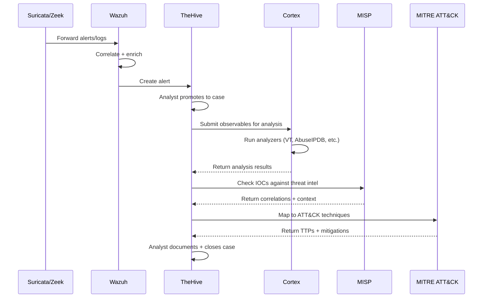
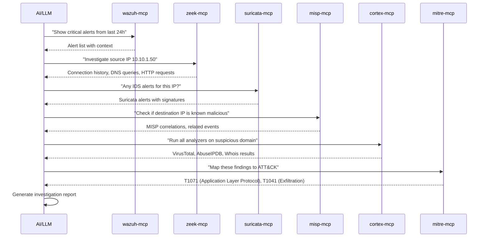

# SOC Stack Architecture

## Design Principles

1. **Modular:** Each MCP server is independent. Use one, some, or all.
2. **Consistent:** All servers follow the same TypeScript patterns, config approach, and error handling.
3. **Demo-ready:** Mock data generators let anyone try it without real infrastructure.
4. **Production-proven:** Playbooks and cases come from real SOC work, not labs.

## Component Roles

### Detection Layer

**Wazuh (SIEM + Vulnerability Management)**
- Central log aggregation and correlation
- Agent-based endpoint monitoring
- Vulnerability scanning via NVD/CVE databases
- File integrity monitoring, rootkit detection
- API: REST (port 55000)

**Zeek (Network Security Monitor)**
- Passive network traffic analysis
- Deep protocol logging (DNS, HTTP, SSL/TLS, SSH, SMTP, etc.)
- File extraction and hash generation
- Connection metadata and flow records
- Output: Structured logs (JSON or TSV)

**Suricata (IDS/IPS)**
- Signature-based intrusion detection
- Inline prevention (IPS mode)
- Protocol anomaly detection
- JA3/JA4 TLS fingerprinting
- EVE JSON output for all event types
- Suricata + Zeek are complementary: Suricata catches known-bad signatures, Zeek provides deep protocol context

### Intelligence Layer

**MISP (Threat Intelligence Platform)**
- IOC storage and sharing
- Event correlation across indicators
- STIX/TAXII export for tool integration
- Warninglist checking (false positive reduction)
- Sighting tracking
- API: REST (port 443)

**MITRE ATT&CK (Framework)**
- Adversary TTP mapping
- Detection coverage analysis
- Threat group attribution
- Mitigation recommendations
- Data: STIX 2.1 bundles (offline, auto-updated)

### Analysis Layer

**Cortex (Observable Analysis Engine)**
- Automated observable enrichment
- 100+ analyzer integrations (VirusTotal, AbuseIPDB, Shodan, etc.)
- Responder actions for automated response
- API: REST (port 9001)

### Response Layer

**TheHive (Incident Response Platform)**
- Case management with full lifecycle tracking
- Task assignment and tracking
- Observable management with enrichment
- Alert ingestion from Wazuh/Suricata
- API: REST (port 9000)

## Integration Flows

### Alert to Case Pipeline



### AI-Assisted Investigation



## MCP Server Patterns

All 7 servers follow the same structure:

```
<tool>-mcp/
  src/
    index.ts          # Server entry point, tool registration
    config.ts         # Env var config with Zod validation
    client.ts         # REST/log API client
    tools/            # Tool implementations (one file per category)
    resources.ts      # MCP resources
    prompts.ts        # MCP prompts
    types.ts          # TypeScript type definitions
  tests/
  package.json
  tsconfig.json
  README.md
```

### Shared Conventions

- **Config:** Environment variables, validated with Zod on startup
- **Auth:** Bearer tokens for API-based tools, file paths for log-based tools
- **Errors:** Consistent error wrapping with meaningful messages
- **Types:** Full TypeScript strict mode, no `any`
- **Testing:** Vitest with mocked API responses
- **Transport:** stdio (primary), Streamable HTTP (optional)
